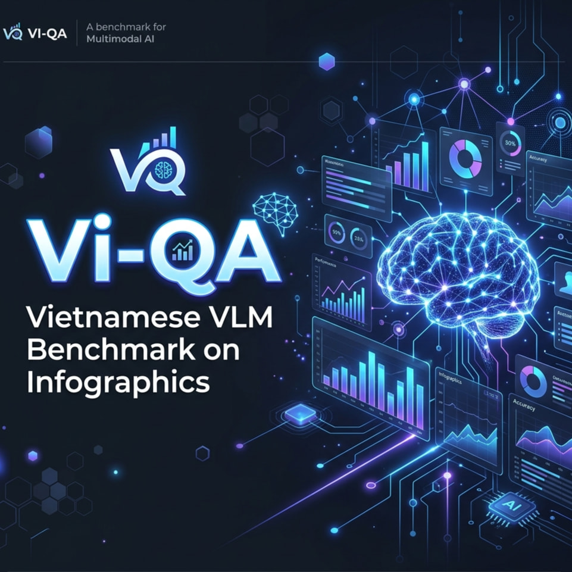

<p align="center">
  
</p>

# Vi-QA: Benchmarking Vietnamese VLM on Infographics 🚀

[](https://www.python.org/downloads/)
[](https://pytorch.org/)
[](https://github.com/astral-sh/uv)
[](https://opensource.org/licenses/MIT)

**Vi-QA** là một hệ thống benchmark mã nguồn mở được thiết kế chuyên biệt để đánh giá năng lực của các mô hình đa phương thức (Vision-Language Models - VLMs) trên tập dữ liệu **ViInfographicVQA** — tập dữ liệu Infographic tiếng Việt thực tế đầu tiên tại Việt Nam.

---

## 📌 Bài toán và Thách thức

### 1. Bài toán: Infographic Question Answering (VQA)
Infographic không phải là ảnh chụp tự nhiên thông thường. Nó là sự kết hợp phức tạp giữa:
*   **Văn bản & Số liệu**: Yêu cầu năng lực OCR cực mạnh.
*   **Biểu đồ & Sơ đồ**: Yêu cầu tư duy về hình học và không gian.
*   **Layout tự do**: Thông tin không nằm theo hàng lối, đòi hỏi model phải hiểu cấu trúc thiết kế.

### 2. Vấn đề cốt lõi
*   **Ngôn ngữ tiếng Việt**: Là ngôn ngữ low-resource trong lĩnh vực VLM. Các model quốc tế thường gặp khó khăn với dấu thanh điệu và ngữ cảnh văn hóa Việt Nam.
*   **Thiếu Benchmarking**: Các nghiên cứu trước đây chủ yếu tập trung vào model quốc tế (Qwen, InternVL). Năng lực của các model "Make in Vietnam" như **Vintern** trên infographic vẫn còn là một dấu hỏi.
*   **Độ tin cậy (Interpretability)**: Làm sao biết model trả lời đúng là do hiểu hay do đoán mò?

---

## 💡 Giải pháp của Vi-QA

Chúng tôi xây dựng một **Modular Benchmark Platform** cho phép:
1.  **Hỗ trợ đa mô hình**: Dễ dàng tích hợp các model mới (Vintern, Qwen, InternVL, Phi-4) thông qua hệ thống Adapter.
2.  **Phân tích chi tiết (Granular Analysis)**: Không chỉ tính điểm Overall ANLS, mà còn breakdown theo:
    *   **Domain**: Kinh tế, Y tế, Giáo dục, Thể thao...
    *   **Answer Type**: Image-span, Question-span, Non-extractive (tính toán).
3.  **Tối ưu thực tế**:
    *   **Resume-safe**: Tự động lưu kết quả sau mỗi sample. Nếu crash giữa chừng, hệ thống sẽ chạy tiếp từ vị trí cũ.
    *   **Memory Management**: Tự động dọn dẹp VRAM sau khi chuyển đổi giữa các model.
    *   **Logging chuyên nghiệp**: Log chi tiết lưu file, Terminal chỉ hiển thị thông tin quan trọng.

---

## 🛠 Kiến trúc Hệ thống

Dự án được tổ chức theo module chuẩn production:

```text
Vi-QA/
├── configs/            # Cấu hình YAML (Models, Paths, Hyperparams)
├── src/
│   ├── data/           # Module nạp và xử lý Dataset
│   ├── inference/      # Hệ thống Adapter và Runner (Engine chính)
│   ├── evaluation/     # Tính toán ANLS và Phân tích lỗi (Error Analysis)
│   └── reporting/      # Tự động xuất báo cáo Markdown và Biểu đồ
├── results/            # Kết quả Output (Jsonl, Reports, Charts)
└── run_benchmark.py    # Entry point duy nhất
```

---

## 🚀 Hiện trạng Dự án (POC-1)

Hiện tại, hệ thống đã hoàn thiện **POC-1** với các tính năng:
- [x] Tích hợp model **Vintern-1B** & **Vintern-3B** (VinAI).
- [x] Tích hợp model **Qwen2.5-VL-7B** & **Qwen3-VL-4B**.
- [x] Pipeline đánh giá ANLS chuẩn xác.
- [x] Hệ thống báo cáo so sánh tự động giữa model Việt Nam và Quốc tế.
- [x] Hỗ trợ RTX 5090 (Blackwell) với Torch 2.7 + CUDA 12.8.

---

## ⚙️ Hướng dẫn Setup

Dự án sử dụng `uv` để quản lý dependency cực nhanh và nhất quán.

### 1. Cài đặt môi trường
```bash
# Clone project
git clone https://github.com/your-username/Vi-QA.git
cd Vi-QA

# Sync môi trường (tự động tạo .venv và cài torch 2.7 cu128)
uv sync
```

### 2. Tải Dataset
Hệ thống đọc dữ liệu từ thư mục `data/`. Sử dụng Git LFS để tải dataset:
```bash
mkdir -p data && cd data

# 1. Clone cấu trúc dataset (Bỏ qua file lớn)
GIT_LFS_SKIP_SMUDGE=1 git clone https://huggingface.co/datasets/duytranus/ViInfographicVQA

# 2. Tải các file lớn còn lại bằng Git LFS
cd ViInfographicVQA
git lfs pull
cd ../..
```

### 3. Tải Models
Sử dụng `hf download` để tải weights mô hình (yêu cầu `huggingface-cli`):
```bash
# Thiết lập token và hiệu năng (tùy chọn)
export HF_TOKEN=<YOUR_HF_TOKEN>
export HF_XET_HIGH_PERFORMANCE=1

# Tải các model trong benchmark
hf download 5CD-AI/Vintern-1B-v3_5 --repo-type model
hf download 5CD-AI/Vintern-3B-R-beta --repo-type model
hf download Qwen/Qwen2.5-VL-7B-Instruct --repo-type model
hf download Qwen/Qwen3-VL-4B-Instruct --repo-type model
```

---

## 🏃 Thao tác thực hiện

### Chạy Benchmark nhanh (Dev Mode)
Dùng để kiểm tra pipeline với 20 mẫu ngẫu nhiên:
```bash
uv run python run_benchmark.py --dev --models vintern-1b
```

### Chạy Full Benchmark cho tất cả model
Hệ thống sẽ chạy tuần tự các model được bật (`enabled: true`) trong `configs/benchmark.yaml`:
```bash
uv run python run_benchmark.py
```

### Chỉ Evaluate lại (không chạy Inference)
Nếu bạn đã có kết quả dự đoán (`predictions.jsonl`) và chỉ muốn thay đổi cách tính điểm hoặc vẽ lại biểu đồ:
```bash
uv run python run_benchmark.py --skip-inference
```

---

## 📊 Kết quả & Báo cáo

Sau khi chạy xong, kết quả sẽ nằm tại:
*   `results/_summary/comparison_table.md`: Bảng so sánh tổng thể các model.
*   `results/_summary/charts/`: Các biểu đồ trực quan hóa (ANLS by Domain, Latency distribution).
*   `results/{model_name}/failure_cases.csv`: Danh sách các mẫu model đoán sai để phân tích thủ công.

---

## 🤝 Đóng góp
Nếu bạn muốn thêm model mới, chỉ cần tạo một Adapter trong `src/inference/adapters/` và đăng ký nó trong `runner.py`.

---
**Vi-QA Project** - *Hướng tới một chuẩn benchmark VLM chất lượng cao cho tiếng Việt.* 🇻🇳
